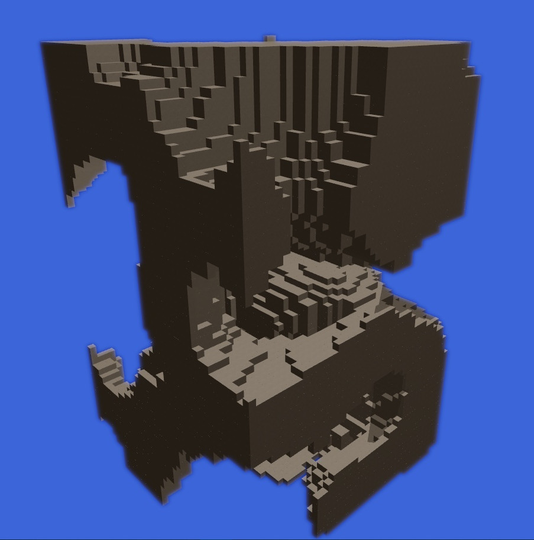

# Perlin-Noise-3D-Voxel-Generator
Voxel generator based on perlin 3d noise | Python OpenGL



## About
This is example program had written in Python that generate blocks similar minecraft.
This implementation is not optmalized because that draw instanced cubes with position offset.
The positions are generating by Perlin Noise. This program do not generation one big mesh.
**Made for learning purpose.**

## Features
- Directional Shadows
- Normal Mapping
- Parallax Occlusion Mapping

## Installation
Install following packages via pip:
1. PyOpenGL: `pip install PyOpenGL PyOpenGL_accelerate`
2. GLFW: `pip install glfw`
3. PyGLM: `pip install PyGLM`
4. numpy: `pip install numpy`

If you have errors after installation you will do following:
1. `pip uninstall PyOpenGL PyOpenGL_accelerate`
2. Download and install PyOpenGL and PyOpenGL_accelerate from https://www.lfd.uci.edu/~gohlke/pythonlibs/

## Control
```
G - to generate the new chunk of world
ESC - to exit the program
```

## Execution
Open your terminal or CMD and call `python executable.py` or `python3 executable.py`

## Knowledge
I recommend you webiste with good amount of knowledge https://learnopengl.com. Thanks to the author Joey de Vries.
